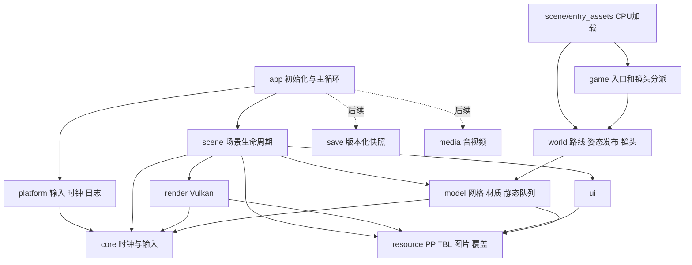

2026-09-30 flow48逐帧CPU已恢复51B647与五辅助函数，见 `reports/special-event-cpu.md` / verification JSON。普通/ASan各6,000随机、876边界、12,000连续CPU帧、357,045调用/1,067失败前缀与4,096直接包络对照一致；共享708878/7C不得另建owner。3普通/3ASan及29Python、指定NVK通过，NRO19778878…仅构建目录，新控制器仅在静态库、未进生产ELF。真实4E29B0资源/4BB82E镜头/4E4472界面/释放及应用仍缺，不能称flow48可玩。721B38=Back、71AF48=角色焦点；groups1/4的4E6138是视频更新。自然记录/像素9/12/实机缺口保持，防休眠64008、本地提交、不推送、不整包。接续local/ending-gallery-next.md。

2026-09-30 鉴赏菜单已接实际应用flow18与全部selection0..6入口，见 `reports/gallery-application.md` / verification JSON。四组普通/ASan配对终态通过；各40,803帧/40入口/25图片/10回放返回/172重绘，显式保存表与结束标记记录夹具不等于自然故事录制。第五类独立背景缺口已按4CE7CB..4CE806补齐；左摇杆/方向键/触屏与闲置光标唤醒已接。8普通/8ASan单测、29Python、指定NVK通过；NRO dd27f0af…/16,175,160字节，新增入口已进ELF。下一项独立flow48（4E29B0/51B647/51B617/4E42E4）、自然记录持久化及解锁链；完整像素9/12与实机缺口保持。防休眠64008、本地提交、不推送、不整包。接续local/ending-gallery-next.md。下文“菜单未接应用”为历史快照。

2026-09-30 鉴赏菜单边界：`scene/gallery_menu`只接收上层提供的解锁字节，不依赖save，保留原指令点击/换页/图片/分派顺序。`gallery_menu_render`拥有真实图片与immutable绘制快照，关闭图片的最后一帧先捕获再延迟释放；下一真实tick才退役，重绘不推进。两组普通/ASan原版与真实纹理/PCM检查通过，见 `reports/gallery-menu.md`。front_end/PlaySession的flow18尚未注册，不能将独立组件验证当成应用或实机验收。

2026-09-30 生产phase8边界：`scene/ending_process`由应用一次持有CPU过程字段；资源森林和延迟快照只借用，交互/鉴赏表达覆盖按原地址分离，共享reverse与保存镜头不复制。`ending_normal_session`将48302B/48BCBB连接五类控制器和实际演员、PCM、BOM、材质与UI；退出请求写frame活动别名后导回common。只读链完成与实际循环边界用于明确的兼容等待策略，不改变model采样速率；严格原指令测试与兼容测试分开。实际五组两路线、应用生命周期、交互回归六项普通/ASan配对通过，见 `reports/ending-gallery-session.md`。前端flow18、自然记录/解锁链和完整验收仍待完成。

2026-09-30 结局节点身份修正：scene将当前森林的719B40交互锚点与719B48显隐视图分开，variant0的719B44不得替代；缺失可选节点保留为空，资源退役不清新场景ID。4D39E6在game中复制实际旧发布5/13/0目标，scene负责原顺序读取；删除根节点替代。证据见 `reports/ending-node-bindings.md`。后续进程owner必须区分交互6DDE98与鉴赏6C7F78/6DDE52，不因同名expression_override而合并不同原地址。

2026-09-30 选择阶段服务直接操作实际actor、UI sprite、PCM与共享表情所有者，删除无人消费的影子UI表。动画restart与audio restart、401B0A固定过渡与4018C8配置过渡保持独立，slot53+166不混同notice+167；见 `reports/ending-selected-adapters.md`。生产phase8与自然结束仍未完成。

2026-09-30 选择阶段实际装配：4D1025只消费当前动作参数与共享721ED8，加载器写721EF0开场gate并保留回放/其他阶段的721EE4；背景替换沿原分支更新selected。拾取和菜单借用同一frame/control/targets/choices，表达式先写共享状态再由表现阶段消费，无BOM绘制传空表。原版标量与真实日文场景配对证据见 `reports/ending-selected-session.md`；phase8夹具只覆盖资源边界，生产回放仍需进程owner与真实服务。

2026-09-30 phase8第五类回放边界：`game/ending_gallery_auxiliary`恢复488674六状态与镜头/语音/音效时序，仅新增原5545FC与6DDCE1过程值；`scene/ending_state_gallery_auxiliary_bindings`借用同一retained.final、GalleryCameraState、presets与表情字段，不复制既有所有者。source写入不推进/发布姿态，音频和模型必须通过真实scene适配；证据见 `reports/ending-gallery-auxiliary.md`。五类CPU齐备，生产phase8尚待进程owner、入口和跨loader装配。

2026-09-30 phase8第四类回放边界：`game/ending_gallery_tertiary` 恢复48758C，通过必需服务调用角色、材质和音频，不推进/发布姿态。`scene/ending_state_gallery_tertiary_bindings`借用同一个GalleryNormalState片段字节与现有retained.final、reverse、expression字段，禁止复制第二个状态所有者。三组材质表与既有原表逐字节一致后复用；越界与条件未初始化局部值在使用处失败并保留前缀。证据见 `reports/ending-gallery-tertiary.md`；下一项488674与生产phase8真实装配。

2026-09-30 phase8选择回放边界：`game/ending_gallery_selected` 恢复4855C9，通过必需服务读写实际动画描述符；source/chain改动不推进或发布姿态。`scene/ending_state_gallery_selected_bindings` 借用已有记录、计时、UI与common所有者；6D1BC0保存焦点和6DDE14轨道/6C7F7C开关共用同一个进程GalleryCameraState。普通/ASan及共享状态回归见 `reports/ending-gallery-selected.md`。生产phase8仍待剩余子控制器和真实服务装配。

2026-09-30 phase8 父控制边界：`game/ending_gallery_control`恢复48302B/483A36，借用已有记录与状态，捕获入口group再按实际时点复制保留记录；`scene/ending_state_gallery_bindings`直接绑定retained.final工作区和同一frame/control/auxiliary。子控制4..8仍为必需服务，不开放空实现入口。FOV过程值独立进程持有，资源重载不等于初始化。原指令/实际状态别名验证见 `reports/ending-gallery-control.md`。

2026-09-30 phase8 效果边界：`game/ending_gallery_effect`恢复完整48CC18及49717C，四个效果/语音标记属于进程生命周期；`scene/ending_gallery_effect`借用当前ActorPose、同一音频owner和共享RNG，只读片段时序，不推进/发布动画。721B3D统一命名event，借用control.variant。普通/ASan原指令和真实日文演员/PCM配对通过，见 `reports/ending-gallery-effect.md`。生产48302B及跨loader绑定仍未完成。

2026-09-30 phase8 表现边界：`game/ending_gallery_presentation`只恢复48BCBB原CPU调度，通过必需回调借用动画、材质、BOM、音频和时钟；片段只读时序用game自有`BkEndingClipTiming`，不会直接调用model/GPU。记录工作区和BOM容量显式提供，越界及缺服务按原执行前缀失败；725704等共享字段不复制出第二个状态。48CC18与48302B及场景装配仍待完成，不能据CPU原指令夹具宣称phase8已接入。见 `reports/ending-gallery-presentation.md`。

# 2026-09-30 结局序列边界：`game/ending_auxiliary_sequence`、`ending_auxiliary_state3` 和 `ending_auxiliary_presentation` 使用 game 层自有的只读片段时序/普通提交类型；`scene/ending_normal_session` 才把它们转换为 model/world 的播放接口。这样 47DC79 state5/6/7 的控制器不会直接依赖 model、Vulkan 或 libnx。证据见 `reports/ending-47dc79-state567.md`。

# 移植工程架构

2026-09-30 增量：`scene/ending_auxiliary_assets` 负责 4D39E6 的 `bk3_12` 资源、保留外层背景、姿态/材质/MORP/MATA和相机轨道；`game/ending_auxiliary_presentation` 只负责 48181F 的 CPU 调用顺序，通过 session 适配器借用资源、森林、面部和音频所有者。该边界不向 `core/resource/model/world/game` 引入 libnx 或 Vulkan，也不把 47DC79 前置控制器隐藏成空成功。验证见 `reports/ending-4d39e6-presentation.md`。

2026-09-29 选择阶段输入依赖：`game/ending_selected_motion` 计算原495469/4952C8的动画源时间，`scene/ending_selected_assets` 绑定真实活动描述符并只提交源时间修改；姿态采样和世界矩阵发布仍由后续阶段显式执行。纯数值和完整资产组合的普通/ASan配对均已结算通过，见 `reports/ending-selected-motion.md`。完整48E75B及4D1025生产入口仍未接通，不将已有CPU依赖等同于可玩选择阶段。手动镜头当前为原始速度6倍，L/R提示与操作同步，自动轨道保持原速，见 `reports/ending-camera-six-icons.md`。

2026-09-29 当前：第三类独立资源/父控制/表现已接故事kind1，见 `reports/ending-tertiary-session.md`；最终图片真实生命周期见 `reports/ending-final-image.md`。`scene/ending_normal_session`在纯UI阶段释放旧演员/GPU，独立保留背景owner和设备灯光值；`lighting_registry`只匹配仍存活的同一模型身份，不复制登记/描述符。UI批次与三维快照分别保留到下一真实tick。第三类长图片阶段后重载仍先登记保留背景材质。图片释放占位group不参与角色校验，缺资源失败保留可销毁前缀。新10项普通/ASan配对、9项单元两构建和架构2项通过；不代表4D1025/4D39E6、gallery或自然结束已完成。下文“第三类仅CPU”“最终图片未接”等为历史阶段描述。

2026-09-29 第三类CPU层见 `reports/ending-tertiary-cpu.md`：476720父控制与479137表现编入共用game目标，普通/ASan各21,000组原父函数对照通过。父控制只新增三个进程字段，其余状态以指针借用；表现借用真实FaceState、共用6AFD04与显式BOM容量，缺少子服务明确失败。当前没有第三类资源／场景适配，也没有注册故事kind1；不得以第二类拓扑代替4D2320。NVK静态库已编译新模块，应用尚未引用，NRO不变。下一步恢复独立装配及真实操作、语音、命中和受控动画服务，继续保持此前背景、灯光和旧画面退役规则。CPU夹具不代表实际资产或实机验收。

2026-09-29 当前结局生命周期见 `reports/ending-stage-lifecycle.md` / verification JSON：普通与第二类控制、表现、音频、UI和独立拓扑已接共享session。背景独立所有，保留背景先恢复挂接、后按原加载/绘制顺序发布；GPU按遍历捕获并保存BOM旧源。UI尾部重载的旧CPU/GPU与纹理快照保留到下一真实tick，音乐及匹配背景灯光状态不重置。五组自然普通→第二类→普通共47,587帧，普通/ASan结果一致；完整第二类场景和边界重载也通过成对检查。原HUD部分初始化保留进程状态，探针必须另外提供清零的进程基线。正式gallery/其他loader/最终图片/完整结局仍未完成；下文“第二类仅CPU、未接父控制”的描述是此前阶段快照。

2026-09-29 第二类结局资源：`game/ending_secondary` 只保存原配置与目标运算；`scene/ending_secondary_assets` 独立拥有 bk3_09 主体、面部/眼、两轨道和可选背景，森林编号0/1,2/3，不借用普通结局的辅助/BOM拓扑。创建成功后才提交调用方镜头、预设和RNG，外层背景单独加载；原版装配和失败清理证据见 `reports/ending-secondary-assets.md`。尚未接入生产入口或47A5D0/47D3CB。`ending-raster-origin.md` 的原点归零仅为探针隔离，生产4:3布局和原容差不变，完整三维仍9/12。

2026-09-29 当前普通结局绘制：`scene/ending_normal_session` 接入既有事件适配器并以真实状态/资源准备独立双视口快照，`game/ending_special`保留原视口初始化算术；`app/play_session`独立持有719c5c音量过程状态，资源所有者只借用。绘制、音频、相机/材质还原与最后一帧退役证据见 `reports/ending-draw-events.md`。整体4:3不变，完整图像仅9/12配对通过，其他loader/自然结局仍未完成；下述较早未接入描述保留为历史。

2026-09-29 结局齐次蒙皮：`core/matrix` 单独提供原522b0d条件齐次除法，原raw四分量接口保持；`model/skin` 使用该CPU规则，`render/vulkan`验证需齐次修正的绑定位置并由compute执行同一容差分支。常规near-unit矩阵不触发CPU逐顶点复算，相同palette不重复dispatch。真实五角色交互、原版数值和GPU回读范围见 `reports/ending-skin-homogeneous.md`。父控制/表现已接入生产普通结局；特殊绘制事件与自然结局仍未完成。

2026-09-29 结局取景绑定：`scene/ending_normal_session` 将实际加载快照传给共享控制/帧状态，后续镜头按钮借用旧发布节点；UI 从活动相机锚点读取 local。原缺失可选命中节点通过显式运行时查询策略排除相应线段，严格原版查询接口继续保留。主体/相机资源所有权和 core/world/game 边界未改变。验证和未通过的完整像素诊断见 `reports/ending-framing.md`，不表示完整父控制器已恢复。

2026-09-29 常规结局绘制装配：`scene/ending_normal_session.prepare_scene_draw` 以真实phase调用既有根分派，事件阶段的视频只在几何准备前更新。阶段1/8包含辅助，阶段9保留视频但不选辅助，阶段7不选对象也不更新视频；纯draw不推进。实际GPU/应用边界验证见 `reports/ending-draw-stage.md`。完整父控制器和特殊场景接管仍待恢复。

2026-09-29 增量：故事结局借用 `PlaySession.game_state.random` 与应用持有的 `BkEndingAuxiliaryCycle`，资源重建不重新播种或初始化倒计时；NULL flow 只用于显式独立诊断。应用往返及普通/ASan资源验证见 `reports/ending-random-state.md`、`reports/ending-auxiliary-cycle.md`、`reports/ending-presentation.md`。组合表现组件的验证不等于生产父控制器接入，完整结局仍未验收。

工作树已经装配首关开发流程，原交付包仍为历史 0.3.5。`app/play_session` 持有进程级游戏状态、路线进度、公共黑幕、菜单光标和流程字节；`game_preview` 是可重建的入口资源所有者，暂停界面借用同一份 UI 状态。标题、游戏、暂停、加载页已通过主机 Vulkan 往返验证。架构与首关接通不代表全部任务/存档/媒体或 Switch 实机验收完成。较早段落为模块恢复历史，当前装配范围见文末和 `reports/play-session.md`。

## 目录与构建目标

```text
config/dependencies.lock.json  版本、Mesa/Rust 来源和摘要的唯一配置
CMakeLists.txt                主机/Switch 共用目标与依赖
cmake/                        devkitA64 工具链、构建信息、ELF/NRO 校验
runtime/
  core/                       固定步长时钟、输入、矩阵、相机投影/视图/画幅、平台无关灯光描述
  resource/                   PP/TBL、图片、归档挂载与资源覆盖
  platform/                   host 和 Switch 的日志、时钟、输入、生命周期
  render/
    renderer.h                不暴露 Vulkan/native 类型的渲染接口
    vulkan/                   Vulkan 实现、NVK/NWindow 呈现
    shaders/                  受版本管理的 GLSL
  ui/                         原创开发提示图层
  scene/                      场景注册、生命周期、标题/办公室、检查相机
  app/                        初始化、主循环、错误回收、主机截图
  model/                      OBJM CPU 数据/层级/材质/纹理/静态队列/LIGH/FOG
  world/                      M1依赖：路线/放置/姿态发布/镜头；M3实体与碰撞待实现
  game/                       M1依赖：入口与镜头分派；M4追踪AI/任务/对话待实现
  media/                      M5：音视频解码与播放时序
  save/                       M6：存档快照、版本与读写
tools/                        提取、资源/模型检查、依赖下载、打包
tests/                        合成样本、边界检查、原版对照、GPU 回读
reports/                      已执行验证的结果与逆向证据
docs/roadmap.md               实现顺序、每步范围与验收门槛
```

`model` 已加入 CPU 解析、节点变换、材质状态、纹理加载、静态实例队列和灯光环境适配。`animation` 已支持相机的 220 字节完整 SRT 关键帧、采样及外部姿态层级组合；`clip` 已支持本批 XAN 的片段调度和过渡；六个角色的稀疏通道/CPU姿态已实现，角色ENVL蒙皮/MORP变形已连接独立检查场景，完整动画事件仍待接入。`world` 已实现路线/放置、角色姿态发布、跟随和交接镜头；`game` 已实现入口选择、镜头分派及经隔离对照的NPC行为/空间/可见性和淡出策略，尚无完整任务流程。`media/save` 仍只有契约，完整 M3/M4 玩法未完成。检查相机属于 scene 的开发工具，不表示 M3 的原版相机、移动和碰撞已完成。

| CMake 目标 | 当前职责 | 直接依赖 |
| --- | --- | --- |
| `bk_core` | 时钟、输入边沿、矩阵、相机投影/仿射逆/画幅、灯光描述及约束 | 标准 C / libm |
| `bk_resource` | 归档、图片、覆盖层 | 标准 C |
| `bk_model` | OBJM CPU 数据、ID 关联、层级、材质、纹理、静态队列、LIGH/FOG | `bk_core`、`bk_resource` |
| `bk_world` | CKP路线、角色放置/缓存姿态、跟随/玩家交接镜头 | `bk_model`、`bk_core` |
| `bk_game` | 入口元数据与镜头分派/结束状态 | `bk_world` |
| `bk_entry_assets` | CPU入口资源适配器，持有路线和演员/镜头资产；被actor检查场景使用，尚未注册为可玩场景 | `bk_game`、`bk_world`、`bk_resource` |
| `bk_inspection` | 检查相机的纯 CPU 输入更新，供 scene 与无 GPU 测试使用 | `bk_core` |
| `bk_platform` | 平台服务 | `bk_core`，Switch 实现使用 libnx |
| `bk_render` | Vulkan 图形管线、可更新顶点与观察者位置的灯光集合 | `bk_core`、`bk_resource`，Mesa NVK 或主机 Vulkan |
| `bk_ui` | 开发提示 CPU 图片 | `bk_resource` |
| `bk_scene` | 标题与办公室注册、CPU/GPU 适配、生命周期 | `bk_core`、`bk_render`、`bk_ui`、`bk_model`、`bk_inspection`、`bk_entry_assets` |
| `bk_app` | 启动与运行编排 | `bk_platform`、`bk_scene` |
| `biko3-preview` | 唯一 main 入口 | `bk_app` |



实线为已实现的模块依赖；entry_assets 已由actor检查场景使用，完整游戏帧编排仍未接入。虚线为后续实现。依赖从上往下，禁止下层反向调用应用或场景。

`bk_model_decode` 从调用方接收资源字节；材质纹理加载接口使用 resource store，不自行打开文件或创建 GPU 对象。`model-probe`、`material-probe` 组合 CPU 检查，`material-render-probe` 验证材质色块，`scene-probe` 验证透视/剔除，并可选加载原版办公室检查相机与生命周期。

## 边界与所有权

- **资源层**只负责名称解析、文件读取和 CPU 解码。它不创建纹理、不知道手柄、不控制场景。
- **模型层**将原文件解码为 CPU 数据，原始字段与推断字段分开。GPU 上传在场景/渲染适配处完成；不得在模型解析器里调用 Vulkan。
- **世界和游戏层**只消费输入快照、时间步、CPU 世界数据；不得直接读取 libnx 按键或依赖帧率。对话、任务、AI 状态与绘制解耦。
- **渲染层**持有 Vulkan instance/device/swapchain/buffer/texture；头文件不暴露 `Vk*` 或 `NWindow`。只有 `render/vulkan/` 可以处理 Vulkan/native surface。
- **平台层**持有输入、系统时间和日志。Switch 通过 libnx，主机是有帧数上限的离屏验证端，当前没有桌面交互窗口。
- **应用层**拥有所有根对象，按 `platform → resources → renderer → scene` 创建，按相反顺序回收；部分创建失败也走同一条清理路径。
- **场景**借用服务，拥有自己的 CPU 场景数据与 GPU 纹理。资源 store、renderer、log 的寿命必须长于场景；先销毁场景再释放 renderer。
- **静态适配器**借用不可变 `BkModel`，拥有世界矩阵、实例列表及队列策略，不含 GPU API。办公室场景持有该适配器与模型，并按可见子网格各上传一份 GPU 网格；同一模型被多个节点引用时复用 GPU 网格，按实例提交世界矩阵。先销毁适配器，再释放模型。
- **GPU 网格**上传后拥有顶点/索引副本，实例矩阵按次提交；纹理与网格绑定创建它们的 renderer，在活动帧之外销毁。材质只提供混合语义，深度写入、排序、灯光与雾须由场景明确配置及验证。
- **环境适配器**从不可变模型和世界矩阵复制 LIGH/FOG 数据，关联 FRAM 的灯光 ID，将点光位置替换为节点世界原点。它拥有 CPU 副本，不创建 GPU 对象；当前只接受至多一个环境光、八个点光、关闭的雾和无高光材质。
- **GPU 灯光集合**由 renderer 创建并持有不可变 uniform buffer/descriptor，场景拥有其句柄，在活动帧之外创建/销毁并等待在途 fence。每次光照绘制显式绑定集合，不修改共享 uniform 内存。普通网格/标题保持原顶点格式；光照网格增加法线、材质环境色和自发光。MVP 与世界矩阵合计使用 128 字节 push constants，法线按世界矩阵的逆转置变换后归一化。奇异世界矩阵明确拒绝。
- `BkBlob`、`BkImage` 的接收方负责释放。资源引用使用 `(pack, name)`，不能跨层长期保存归档内部的 `BkEntry *`。

当前单线程调用归档的 `FILE *`。未来异步加载必须增加独立文件句柄或显式调度，不允许直接把现有 store 放入多个线程并发读。

## 资源覆盖规则

通过 `bk_resources_mount(store, pack, path, error)` 显式挂载：先基础包，再同一逻辑 pack 的覆盖包。读取只使用 pack 与条目名，不在上层拼接文件偏移。

1. 同一 pack 后挂载优先；pack 名和资源名按 ASCII 不区分大小写查找。
2. 覆盖包没有该条目时，继续查基础包。不同 pack 不互相覆盖。
3. 覆盖包损坏、选中条目读取失败时明确报错，**不能退回旧数据掩盖损坏**。
4. 挂载失败不改变已存在的挂载；最多 64 个挂载。
5. 原版输入只读，解码内存由调用方释放；当前不加入全局缓存。

通用覆盖机制已经实现并经合成资源验证；当前应用按场景需要挂载原版 `bk3_00`、`bk3_03` 或 `bk3_04`，每包只挂载一次。汉化包的批量挂载、文本编码、字体和原版版本匹配仍属于 M6，不把“覆盖机制存在”当作“汉化已完成”。

## 主循环和场景契约

```text
平台轮询 → 保存输入边沿 → 计算 60 Hz 固定步
    → 每个固定步：消费一次输入 → scene.step
    → renderer.begin → scene.draw → renderer.end
退出 → 可选主机回读 → scene / renderer / resources / platform 依次释放
```

每帧最多补 8 个固定步，超出时长记录为 `dropped_seconds`，防止长时间暂停后持续追帧。零个固定步的帧保留输入边沿；多个固定步只有第一个收到 pressed/released，held 和摇杆值持续有效。回退时间或非有限时间不会进入模拟。

`scene.step` 更新状态；`scene.draw` 提交绘制并可使用插值系数。静态标题没有模拟回调；办公室仅更新检查相机，其几何保持 FRAM 基础姿态。`BK_SCENE_STATIC_WORLD` 已注册为真实办公室，未知枚举仍明确失败。Switch 默认办公室，主机默认标题、可用 `--scene office` 选择办公室。

办公室 B / 标题 A 触发场景切换：在活动绘制帧之外先完整构造新场景，再销毁旧场景并替换，清空输入边沿和计时积压。加载失败走应用统一错误回收路径并显示诊断，不静默继续旧场景。`+` 退出。检查相机 A 重置、摇杆移动/转向和十字键升降，不处理游戏碰撞。

静态路径保留模型原坐标、UV 和索引。CPU 使用行向量 `world = local * parent`、`MVP = world * view * projection`，视图为左手系；矩阵字节直接作为 GLSL 列主序矩阵使用，等效转置。投影统一翻转 Y，深度映射至 `[0,1]`；正高度 viewport、顺时针为正面、背面剔除，UI 不剔除。具体原版地址、GPU 检查和未覆盖范围见 `reports/static-scene.md`。

`core/camera` 接收明确的镜头参数和相机世界矩阵，输出 Vulkan 投影、视图逆矩阵和居中画幅，不包含场景编号、角色、动画或流程状态。原版主循环的镜头预设由办公室 scene 选择。检查相机只生成开发用世界矩阵，不能把通过原矩阵函数对照当作恢复原版镜头运动。

`BkViewport` 不暴露 native 类型。场景读取 renderer 实际 extent，以 4:3 计算居中整数矩形，再在活动帧内同时设置 viewport/scissor；绘制开发提示前恢复全屏。每次 begin 自动恢复全屏状态，清屏覆盖整个目标，因此黑边不会残留上一帧内容，标题不会继承办公室的裁剪。奇异/非仿射矩阵、无效投影和越界视口明确拒绝。原版证据及状态覆盖顺序见 `reports/camera.md`。

## 构建与依赖

```sh
./build-host.sh             # core/resource/platform + 无素材测试工具
./build-host.sh --vulkan    # 再构建渲染、场景和主机预览
./build-switch.sh           # 相同上层源码 + Switch 平台 + 指定 Mesa NVK
./test-host.sh              # 合成测试、架构边界、GPU、ASan/UBSan
./test-host.sh local/game/MAINDIR  # 再做原版资源、标题及办公室生命周期对照
```

需要 CMake 3.24+。主机与 Switch 使用不同构建目录（`build/`、`build-switch/`）和独立生成头文件。常规 CPU sanitizer 使用 `build/asan/`，M1.3 的包含 Vulkan 的 sanitizer 验证使用 `build/asan-static/`；均不污染正常构建。生成 SPIR-V 和版本头不提交 Git。

`config/dependencies.lock.json` 是版本和依赖来源。CMake、下载工具、运行日志、NACP 和打包清单都从它读取。SDK 更新必须修改锁定值、重新验证 Rust 匹配与链接，再跑有关测试，不自动追随远端 HEAD。

Switch 每次链接后检查未解析符号、生成 NRO 和 `build-manifest.json`。打包要求 NRO 哈希、版本、Mesa 提交与构建清单/锁定文件一致，拒绝拿旧二进制套新标签。

## 验证分层

| 层级 | 入口 | 能证明什么 |
| --- | --- | --- |
| 架构 | `tests/test_architecture.py` | include 依赖方向、私有接口和 native API 边界 |
| 基础 | `test-core` | 固定步、追帧上限、输入边沿生命周期 |
| 相机基础 | `test-camera`、`original_camera_oracle.py` | 仿射逆、投影、画幅和初始化选择；未验证实际流程姿态或 ANIM 采样 |
| 相机轨道 | `test-animation`、`original_animation_oracle.py`、`scene-probe` | 完整 SRT、原版循环、世界姿态及实际绘制；不覆盖角色锚点和游戏调度 |
| 静态 CPU | `test-static`、`test_static_model.py` | 矩阵/投影、检查相机、实例关系、队列状态、明确拒绝未支持状态 |
| 资源服务 | `test-store` | 覆盖优先级、pack 隔离、回退、挂载回滚、读取失败传播 |
| 解码 | Python 合成测试、`fuzz-assets` | 合法/畸形输入与内存检查 |
| 原版 | `audit_game.py`、`original_tbl_oracle.py` | 原版索引/图片和原生解码输出的一致性 |
| 静态原版规则 | `original_static_oracle.py` | 队列分支和已给定距离键的排序；不覆盖完整遍历或原版相机 |
| 光照 CPU/原版 | `test_environment.py`、`original_lighting_oracle.py` | LIGH/FOG 结构、提交参数、节点位置和环境光量化；不覆盖游戏各遍的选灯策略 |
| GPU | `render-probe`、`material-render-probe`、`scene-probe`、`lighting-render-probe`、`camera-render-probe` | Vulkan 像素、几何、光照公式及生命周期；不代表 Switch 实测或完整原版画面对照 |
| Switch 构建 | ELF/NRO 校验 | ARM64/NVK 可链接，不证明实机可玩 |
| Switch 实机 | 后续记录 | 初始化、呈现、输入、内存、性能和实际流程 |

架构重构以原标题 RGBA 逐像素相同作为集成回归条件，不能仅凭编译成功验收。未来新增功能必须在对应层增加有意义的验证，不重复扩大已经通过且未受影响的检查。

## 相机轨道与片段适配

`BkModelAnimation` 借用不可变模型并拥有解码后的关键帧；必须先释放动画再释放模型。`bk_model_animation_sample` 接受绝对源 tick 和显式循环策略，返回世界矩阵；内部临时姿态与资产分离，失败不改调用方结果。未动画化节点使用基础局部姿态。支持完整/稀疏 SRT 和线性位置，保留非单位四元数；曲线位置及旧布局明确拒绝。

`BK_SCENE_CAMERA_TRACK` 共用办公室绘制，从 `bk3_04/cam00_02.xan` 读取真实片段及模型引用，加载 `.x / Cam_AUTO`。应用在 X 边沿切换该场景与办公室，B 返回标题，A 重启槽 0。它仍是未绑定真实角色的资源诊断场景。资源根、当前场景与包挂载位由 application 管理，先构造后销毁及错误回收契约继续生效。

`BkClipSet` 拥有解码配置，`BkClipPlayer` 借用该配置并持有独立时间轴状态；依次销毁播放器、配置。不恢复磁盘指针；普通构造创建新播放状态，显式 authored 构造校验并保留原 XAN 播放标量。选择与推进是纯 CPU 操作，输出一次单点或双端 SRT 采样请求；0.3.5 的 `BkModelPlayback` 负责将请求交给 `BkModelAnimation` 并原子提交时间和姿态。初始/重启后执行零时长提交，固定步传入半速秒数，调度器内部乘 60 得时间轴 tick，进一步通过片段速度映射到源 tick。不能继续把它等同于 30 源 tick/秒。

`core/camera` 的朝向和跟随姿态数学接口接收已有姿态及调用方提供的世界点，只负责方向、平滑和原版先朝向后更新位置的顺序；不读取角色、查询碰撞或推进游戏流程。0.3.5 已提供真实角色头节点采样与根放置；0.3.5之后已实现角色/镜头的显式世界矩阵发布，以及入口、镜头分派和两种交接；尚未接入应用主循环，检查场景不填入替代目标。片段布局、调度边界、原函数对照及限制见 `reports/camera-clips.md`；`reports/camera-animation.md` 保留 0.3.3 历史状态。

`BkModelPlayback` 的创建仅发布基础姿态，不隐式推进 authored 动作。选择/请求只改变时间轴；成功 advance 后才发布采样姿态，失败保留此前时间与矩阵。外部根必须是无 ANIM 轨道的根节点。调用方明确选择何时读取旧世界姿态、何时提交新姿态；不能在 model 层推断 actor AI 或游戏帧顺序。

## 入口资源与帧发布（0.3.5之后工作树）

`resource/store` 支持只读散文件目录挂载，用于PP外的CKP。仍以逻辑pack和basename读取，大小上限必填；忽略大小写但同名冲突明确失败，读错不回退。`entry_assets` 要求调用方挂载bk3_01、bk3_04及routes/faces，构造失败释放全部部分资源。它拥有三组模型/XAN、两名演员的姿态实例、路线和镜头；资源store不被长期持有。

`game/entry` 接受显式group/area/previous_flow/route_cursor。先恢复入口phase优先级，再选路线、角色、出生位置和camera asset；游标在读入具体路线后校验。原mode-2重置world为(0,20,0)的单位朝向，而随后的平滑位置来自NPC原点，这两个初值不同。前流程8/0x38会将办公室phase覆盖为0，不能以area>=8的中间state3直接选择最终镜头。

`model/playback` 支持原子request+advance和不推进时间的place；后者重组最后已提交采样，未首次推进时使用资产基础locals。`world/actor_pose` 仅拥有姿态，不移动/选择AI：根安装立即可见，头与其他子节点在publish后才更新。scene适配器按game策略消费缓存头节点执行跟随或玩家交接；phase1的玩家输入控制仍明确未实现。调用方负责角色更新、碰撞、剧情和绘制发布时机。

`entry-probe Data目录` 用45组真实入口做加载/失败清理、静止姿态缓存和两种交接/保持检查；不是完整AI或原版帧截图。详见`reports/entry-binding.md`。

`scene/face_assets`拥有FAM指定的不可变MORP键、独立选择绑定及共享CPU目标顶点；初始化和request/mouth/blink通过批次原子提交。资源和原模型可在构造后释放。entry_assets持有NPC面部资源，时钟、RNG与控制器初始化仍由调用方显式给出；不隐式开始游戏或读取系统时钟。FAM的眼材质/位图字段仅保留，尚未驱动纹理。

## 动态角色与帧前上传（后续工作树）

`scene/actor_render`借用不可变模型与renderer，拥有纹理、GPU网格、ENVL实例和复用的CPU转换缓存。prepare在renderer.begin之前读取已经发布的actor world、隐藏标志、材质实例和FAM变形顶点；不自行推进或发布角色。蒙皮输出用单位world，其他部分保留拥有节点的world。隐藏父节点抑制子树入队，alpha=0的材质仍保留排序位置，实际绘制时跳过。准备失败使该帧不可绘制，后续成功prepare完整重建；不承诺跨GPU错误的回滚。

GPU网格提供固定顶点数量的update。更新和观察者uniform更新均先验证、等待上一提交的fence、复制和flush；不允许在活动帧中覆盖数据，逐帧不重新分配GPU对象。灯光颜色集合仍固定，摄像机世界位置可显式更新。光照顶点增加材质specular/power；单独的lit片段着色器在纹理乘色后、混合前加逐顶点高光。常量正W保留到裁剪坐标；灯光使用与原始world*view XYZ等价的观察者偏移，不能提前将资产矩阵强制归一化。

`model/triangles`将原始header+56的0/1/2列表、非索引条带和扇面转换为GPU索引三角形列表；条带/扇面按顶点序列，忽略磁盘索引，不删除退化三角形。`static_model`现为可复用的基础布局/材质元数据适配器；上传必须经过triangles接口。

`BK_SCENE_ACTOR_PREVIEW`已显式注册，主机`--scene actor`、Switch Y可进入。应用额外挂载bk3_01及routes/faces散文件；entry(0,8)用于实际演员资源，摄像机/灯光仍为明确的检查设置。检查场景半速推进当前动作，静音口型输入为0，推进眨眼；不运行AI、路线、音频、眼纹理或任务流程。它证明动态路径进入应用和Switch链接，不代表完整游戏或硬件验收。bk_scene现在还依赖bk_entry_assets。详见reports/actor-render.md。

后续`scene/eye_assets`拥有替换位图与FRAM/目标索引，由entry持有。actor_render借用直到销毁，独立上传备用纹理并在prepare捕获选择。槽0复用目标原纹理；第5行加载槽1，缺失可选资源为空槽，损坏资源报错。选择不影响眼球朝向变体。当前应用仍无自动纹理命令或gaze；CPU/GPU切换已验证，详见reports/eye-assets.md。

后续`world/eye_pose`已提供原眼球函数，scene/eye_assets映射原命令。actor_pose拥有独立parent-world缓存；眼更新只修改两个节点local/world，随后遍历才发布后代。model/playback改为增量locals提交：未发生ANIM提交或不在轨道内的程序改动必须保留。`bk_model_playback_edit_locals`原子修改非根节点，root仍走显式放置接口。详见reports/eye-pose.md；应用没有自行增加gaze策略。

actor_pose构造改用`playback_create_started`：保留XAN原状态后立即执行原初始请求/选片，再得到有效播放器；旧inactive槽只作为过渡起点，不能直接运行。普通authored/fresh构造语义未改。见reports/actor-start.md。

NPC网格阴影由`scene/npc_shadow`拥有静态OBJM、独立XAN和无头节点的actor_pose。缺失ANIM是合法零轨道，损坏ANIM仍失败。显式place/step/publish保持空间、完整秒数时钟和缓存发布边界；entry可选拥有它，图形设置2另走投射后端。详见`reports/npc-shadow.md`。

`entry_assets_step_npc_presentation`组合原4fc36d，接受显式音量/时钟、独立face状态和共享RNG；主体半速、阴影全速，隐藏不暂停脸部或淡出。它不执行空间/脚步、不发布child world。基本输入拒绝不修改；后续子步骤失败为当前帧致命错误，不承诺多对象回滚。actor诊断场景使用此入口，详见`reports/npc-frame.md`。

`world/timeline_event`消费调用者拥有的共享tick字节，`world/spatial_audio`输出原音量/pan单位；`game/npc_footsteps`只生成有序资源事件。entry从当前active source/placement/地面名生成事务性事件输出，音频消费属于media/platform，不能把生成事件当作已播放。详见`reports/footsteps.md`。

CPU音频目标`bk_media`已加入，当前只依赖公共编译选项/libm。`pcm`拥有不可变PCM16；`pcm_mix`按显式输出采样帧数计算源位置/循环与混音，使用整数有理相位，全部声音先float累加后限幅。平台须分开提交/已播放游标，尚未连接设备、队列或游戏音频。此为NPC真实帧的媒体依赖，不表示M5整体完成。

音频当前由`media/audio`持有clip与32槽播放版本，`platform/audio_output`提供单线程push sink；成功submit才推进提交时钟，poll只接受单调且不超过提交量的已消费计数。`scene/npc_audio`可以依赖media并把已消费源PCM窗口交给world包络；world/game不反向依赖设备或媒体。Switch以回收缓冲给出10ms消费下界，主机离线探针显式控制消费；二者证据不混用。原生接口边界新增`platform/audio_switch.c`，libnx stub只进入测试目标。


玩家普通空间更新由`game/player_movement`→`world/player_wall`→`game/player_scene/player_spatial`组合，`scene/entry_assets`绑定真实active clip/缓存头和根放置。`core/camera`提供原屏幕投影，调用方显式提供缓存view/lens/viewport；空间更新不提前推进动画或发布子节点。原版异常几何有可审计计数，不能用未初始化内存复刻。详见`reports/player-spatial.md`；完整交互/脚本移动/相机和应用循环另行恢复。

玩家交互进一步由`game/player_trigger/player_interaction/player_script/player_control`组合，scene读取model任意槽timing转成game快照。game不引用model播放器；目标选择/动作分支为CPU状态变化，root及shadow为显式输出。entry绑定真实slot/缓存头，control之后再推进动画/发布。原菜单/UI热键未纳入输入，不假造其副作用；阴影输出不代表玩家阴影实例已创建。详见`reports/player-interaction.md`。

玩家相机由`world/player_view`执行纯CPU镜头数学、`game/player_view_policy`决定路由，`world/follow_camera`绑定真实轨道/旧发布缓存，scene衔接玩家碰撞距离、根可见性与返回朝向。平滑XYZ、+4a4矩阵与渲染world独立，game不得直接读取model。详见`reports/player-view.md`。

玩家4bfea9由scene组合独立材质、硬隐藏、game/player_events、同步声音消费者、body与独立kage_01实例。player_audio消费规则输出并绑定media最新命令status；口型继续使用audible cursor。两套tick库中709084一组与NPC共享，noise在完整驱动中同步到NPC stimulus。原未定义方向采用0并显式计数。详见`reports/player-presentation.md`。

world/collision拥有静态前缀和每帧动态后缀；begin_props读取显式前16道具模型/缓存world，原子替换后缀，end_props只释放后缀。game/scene负责实例生命周期与帧顺序，不能把刚推进的动画缓存提前供给碰撞。kind单独查询保持现有mesh ABI。详见`reports/dynamic-collision.md`。

全局场景拓扑由`world/actor_forest`持有，借用各所有者的`BkActorPose`，内部边按文件顺序、根由场景显式挂接。场景把访问结果映射到`BkActorRenderVisit`；资源所有者保持动画/放置权和实例寿命。原相机预遍历独立于发布。背景/门诊断已接通，详见`reports/actor-forest.md`。

`scene/entry_forest`借用入口、背景和道具所有者，将已实现根按原加载顺序交给world森林；雪归活动相机。`follow_camera`自身持有ActorPose，读同一份Cam_AUTO发布缓存，避免独立副本错时。4ec9f0物品尚待绑定，详见`reports/track-forest.md`。

`game/item`负责物品配置、初始化和拾取的有序状态/服务调用，`scene/item_assets`拥有原bk3_16模型/XAN并接全局节点。拾取逻辑hidden与下一显示阶段的节点hidden分开；音效和提示文本通过必需服务提供，见`reports/items.md`。

`resource/message`只解析有界原始字节，`scene/item_feedback`拥有物品消息资源/PCM并借用独占声道，通过game/item服务接口执行原顺序。字体/绘制独立，尚未把裸消息当成完整UI，见`reports/item-feedback.md`。

`resource/font`拥有FTT不可变数据，`ui/text_layout`只生成借用字形记录，`ui/text_image`生成完整未滚动遮罩，均不依赖native/GPU；bk_ui现可独立构建CPU测试。scene将负责字体显示缓存、纹理、原提示状态装配；不能用遮罩采样诊断代替完整UI。

`ui/text_flow`管理纯时序，`ui/text_canvas`借用字体并拥有原1280x960栅格/窗口缓存，`ui/text_draw`输出原多遍描述；`scene/text_render`负责资源与GPU更新并接受显式游戏视口。提示可见性/计时仍由game规则和scene装配，字体组件不推断玩法。

`ui/fade_sprite`为明确enter1/exit1/idle0子集；`scene/item_notice_state`组装共享pickup计时字节、panel/icons与font门控，`scene/item_notice_render`拥有真实提示图像和文字组件，在帧外prepare、帧内提交。bk_entry_assets显式链接bk_ui，以保持game不依赖UI/scene。

`game/npc_detection`直接更新既有NpcSpatial/Interaction；`game/area_boundary`纯规划道具hidden、共享ambient gate、NPC隐藏/声音latch和player response，按原次序输出两声道命令；`scene/area_audio`使用独立NPC+568通道并调用现有player effect服务，不将它误接脚步或口型通道。

`game/prop_interaction`借用现有角色状态，在16槽原顺序规划互动与有序音频命令；`scene/prop_assets_bind_interaction`提供实际root world与状态所有者，`prop_audio_interact`随后调用media保位pause/resume。逻辑动作变更留给下次presentation，不在交互时刷新动画或world。

开场4c1313由scene先请求原XAN，再调用game/player_idle_step执行保留身高/速度的物理和root placement；actor_pose_request没有采样副作用。follow可选距离输出在成功后写入共享camera_distance，handover/hold不清它，phase1 view继续消费同一值。

NPC空间输出保留路点触发时的位置；npc_event_audio借用global system_audio和area_audio，实现AI→等待→路点顺序。AI双缓冲音量在初始化捕获，route用live master；同一NPC+568由route和area共同拥有一个服务，禁止拆成重叠声音。system_audio当前只拥有BEF050，跨入口保留。

scene/game_frame借用完整入口服务和显式session状态；game/frame_dispatch只编排原阶段和失败清理，不操作资源。玩家事件noise与NPCstimulus共享，player/NPC音效tick银行同一数组，所有世界孩子缓存只在后续draw发布。phase选择在追加动态碰撞后锁定，帧内phase变化不改本帧路线。

follow_camera_step_collision把真实碰撞嵌在第一次平滑后、修正前，缩短距离和probe与player控制器共享。world/follow_obstacle保留原每mesh旧交点/原点miss和无高度过滤；原NaN交线显式跳过并计数。central不再依赖外部障碍miss服务。

game/actor_entry负责演员局部重置策略，entry_assets一次性绑定预放置头高度与自有route；scene初始化必须先于item创建，保留未被原版写入的session字段。npc_entry_route不是插值segment。玩家completion/outcome和NPC库存条件在中央帧共享；完整外层loader/51a190仍独立。

entry_resolve先解析目标profile再查进度；game_frame_boot_state是一次性进程基线，与关卡重置分离。initialize_entry只组合演员+mode2镜头CPU初态，保留sensor/lean/timer，完整UI/媒体/资源生命周期由后续上层组合负责。

resource/dialogue只处理原字节脚本/游标/元数据，不持有文件/播放媒体；scene保有blob和按阶段消费pending标志。开场与item消息有独立原状态，切换font/flow顺序仍须上层按原版实现。

opening_session借用entry/game-frame、dialogue_assets、item_feedback/system_audio和共享字体所有者；opening_phase按真实调用顺序直接写live bindings，失败终止。item_notice_render同一面板/字体覆盖开场和物品提示，old_phase在交接之前锁定。先game_frame/世界遍历再opening/notice UI，不能把后者并入相机更新之前。

common_hud拥有跨入口黑幕/门限/操作锁定，借用outcome/response/menu/global flow字节；step先捕获draw opacity后处理资源/转场服务。flow_transition只处理51c47e调度，必需真实release callback；mode2保持资源，其他模式先释放。outcome_audio与点击声区分Play续播/rewind语义，curtain_render生命周期在场景之上。

player_hud保存操作界面的持久CPU状态与有序逐draw快照，session适配器借用game_frame状态与实际设备镜头。render拥有可保留纹理/每次draw独立网格；49d0eb截图必须在覆盖层后执行，不能在完整HUD后再截。未可用道具的无定义投影有单独unprojectable标记。

帧内截图由render同步读回并LOAD恢复颜色/深度，scene负责HUD截图边界、裁剪、水印和BMP。app把scene的输出回调接至save/capture_file与平台时钟；scene不依赖save。capture_file只写独立输出目录，替换失败保留旧文件；游戏存档另行实现。

game/player_hotkeys只处理解码后的edge动作及有序服务边界；scene/game_frame在旧script_phase0的交互前调用，借用真实system声音和screenshot请求服务。game_frame.hotkeys拥有menu和photo_count/table，HUD直接借用。album_group在帧前锁存，截图保存请求时复制它。音频64槽为全场景加持久UI保留独立声音。

flow_loading借用common_hud共享黑幕与flow_transition字节，逐draw快照保存loader之前的alpha，回调严格执行实际目标资源生命周期。loading_render持有加载页纹理，避免加载中释放页面；提示采用1024×768分轴比例，背景采用1280宽度比例。控制逻辑不把成功空回调作为生产loader。

`app/play_session` 的每次游戏步进必须完整绘制并提交后才允许下一步。实际应用的游戏步长由 `core/game_clock` 恢复原 `4adc16` 的隔帧取样及保持，不能用普通单帧秒数替代；墙钟由 `bk_play_session_step_at` 独立输入。黑幕准备仅对 fade 副本推进，捕获即将绘制的透明度；提交后才执行一次真实 common_hud，包括当帧截图依赖的暂停加载与流程切换，并核对透明度一致。GPU 资源逻辑释放时停止游戏音频，最后绘制快照的资源在下一步帧外回收；零更新重绘不重复公共状态和加载副作用。游戏每张画面只提交一次，不再补算并再次呈现。固定补步仅供检查场景。

暂停保留玩家/NPC/碰撞、背景动画、计时与随机数；51a77c→4f720c仅继续音乐/持续环境声的音量更新。同一个 common/flow/cursor/pause CPU 状态跨菜单保留。entry_create借用保留 GameFrameState/EntryProgress，只有play_session首次创建执行进程boot；初始化不清照片计数。`app/capture_output`桥接scene与save，照片与游戏存档使用独立文件适配器。

`scene/failure_hud`借用公共黑幕、原开场panel/prompt/text及角色状态字段，输出51afcb绘制快照，调用实际消息绑定/释放/调度服务；失败保持原副作用前缀。`world/failure_camera`纯CPU恢复五个失败镜头，FOV变更与完成判据显式返回，不直接访问设备。play_session现已绑定失败40、重试68和区域交接20，具体证据见对应报告。

`scene/save_menu_control/view/labels`分别处理507540输入、5095d5有序绘制快照及槽位文字；没有文件访问或游戏状态的隐式全局读取。`scene/save_menu_render`拥有实际图片、字库和GPU资源，按快照的text_after插入文字；零步重绘不重复存取。日文版使用Shift-JIS标签与Type_G.FTT，汉化包不作为运行依赖。

`app/save_preview`桥接这些UI组件和`save/checkpoint_file`，显式借用当前group/area、五个道具字节、另三个保留字节与共享RNG。保存记录的是区域入口检查点，不能当作任意帧快照。文件适配器只访问传入的可写根目录；缺失银行为空槽，损坏银行终止，单槽更新通过临时文件flush/fsync/rename提交。`app/play_session`注册flow28，保留共同黑幕/光标/菜单CPU状态，释放GPU资源仍延迟至最后快照提交之后；从暂停读取成功先释放旧game，再由flow50实际创建所选入口，取消则恢复物品消息/字体并重建暂停资源。

游戏计时当前证据见 `reports/game-clock-fps.md`，取代早期将 `733700` 等同单帧墙钟的假设。暂停/重试/区域提示/保存子页面在更新前接同一真实墙钟；秒数步长仍遵循原游戏采样。FPS由同一原计数器产生，scene仅负责可移植字形绘制，app在游戏截图完成后叠加。

`core/lighting`以公共描述保存点光/聚光，合计最多8个；`model/environment`恢复原节点位置和聚光方向，`scene/lighting_assets`只消费明确提供的已发布缓存。Vulkan独立打包锥角/方向并逐顶点计算衰减；原LIGH、选灯注册表和GPU描述符保持分层。灯光更新保留相机与雾。详见`reports/spot-lighting.md`。

`scene/selection_world`拥有选择页双轨/舞台/演员/灯光/forest，借用保留镜头；按51ac5d分阶段更新，媒体为必需注入服务。替换成功将旧演员所有权移交外层，等待旧GPU快照完成再释放。`selection_render`只为已支持的正常外观准备两个独立灯光/几何flush，雾状态显式输入；61视频未实现时明确拒绝。UI控制必须在原3D和UI绘制快照之后，不能把资源重载提前到旧画面准备前。

`scene/selection_session`按世界更新→两次3D快照→UI绘制快照→UI控制组合。控制可替换资源，旧快照的CPU/GPU owner一直保留到提交后下一步。独立after_present强制每步呈现，无更新重绘无副作用。音频输出/解锁/共享状态来自上层，session只拥有flow38资源并发出目标请求，不实现尚缺的flow8或视频。

`media/avi`独立拥有容器字节/索引，decoder借用AVI并原子发布RGB555；avi_clock恢复独立signed进程毫秒，avi_surface明示DIB/设备政策。scene/avi_texture拥有CPU/GPU媒体，renderer只承接RGBA暂存和下次begin的传输，不依赖media。选择61由selection_render拥有视频并借给actor材质表面；保留原纹理alpha提示/排序ID，旧媒体与旧GPU快照共同延迟回收。详见reports/avi-texture.md，未把其便携DIB政策当作Windows完整画面证明。

2026-09-28 GPU蒙皮：model/skin仍为CPU原格式及原数值参考；scene/skin_upload只在加载时生成有序影响表及固定权重分支。render仅接收通用palette/权重/源顶点，Vulkan compute写可绘制顶点并显式同步，不依赖model/world/game。world/actor_forest在整次预检后经world内部接口提交已计算缓存，外部不得绕过检查。游戏视线/碰撞读取CPU已发布骨骼/原碰撞几何，不读回GPU蒙皮。`BK_CPU_SKINNING=1`保留诊断对照。

`scene/dialogue_actor_assets`拥有真实五组主体/脸/眼并组合4f11f2；借用控制码、phase、共享计时器/RNG、显式消费游标包络和固定镜头。CPU层不播放声音、不发布world；外层按原帧阶段发布/绘制。读取请求槽完成次数用model/world的只读any-slot接口，不能据活动槽推断。中途失败终止帧，不宣称整帧回滚。

对话背景状态由`scene/dialogue_backdrop`借用人物phase/expression和独立黑幕控制，不代管公共转场；`scene/dialogue_backdrop_render`拥有实际图片/黑幕GPU资源，帧外替换与准备、帧内只绘制快照。失败保留旧纹理供回收/诊断，应用仍必须终止失败帧。原规则/几何与GPU验证见`reports/dialogue-backdrop.md`，完整flow8尚未装配。

剧情媒体由`scene/dialogue_media`消费借用的原pending/音乐状态并发送必需服务命令；`scene/dialogue_audio`拥有真实PCM clip、借用混音器与两保留槽，复用消费游标包络。初始加载、语音、音乐分步接口供原外层顺序装配，不擅自合并成帧循环。验证范围见`reports/dialogue-audio.md`。

`scene/dialogue_ui`借用parser/text/backdrop/公共黑幕和结果状态，恢复4f0e44原服务顺序；持久解锁和转场必须注入真实服务。`dialogue_ui_render`拥有面板/提示/Type_S字库与GPU资源，帧外准备、帧内只绘制快照，公共黑幕归外层会话。初页strlen与后续原字节CR计数分开，未将此组件伪装为完整flow8。

## 原版菜单/剧情的应用所有权（2026-09-28）

`game/dialogue_entry` 仅输出原选择结果；`scene/dialogue_entry` 拥有脚本字节，`dialogue_world/render/session` 分离真实CPU实例、GPU提交和帧顺序。`app/front_end` 管理标题1/选人38/剧情8，借用外层公共黑幕、光标、RNG、进度；外层 `play_session` 处理加载50与存档/游戏转换。菜单不得直接读写存档；尚未实现的解锁持久化回调明确失败。所有GPU回收晚于旧快照提交，按现有资源生命周期规则执行。默认 `game` 的首屏为原版标题；`title` 场景仍是显式素材检查。详见 reports/original-front-end.md。

鉴赏进度与关卡存档独立：`save/unlock`为纯40字节表和原/移植编码，`save/unlock_file`拥有输出文件。`application`拥有文件服务，`play_session/front_end`借用；scene只借用只读表。结局工作表721dc6需由真实flow16生命周期产生，完成前禁止从关卡道具或输入猜解锁。


`game/ending_frame`借用独立工作表与实时帧状态，按原phase锁存和尾部重读调度必需子服务。原地址只标识待恢复语义，不作为可执行指针；缺服务终止，前缀副作用不回滚。平台时钟/按键从外层注入；资源/姿态/镜头仍由实际scene/world控制器处理。完整入口和工作表生产完成前不得接空回调或持久提交。详见reports/ending-frame.md。


结局镜头数值由`world/ending_camera`处理，借用同一菜单镜头状态与显式旧缓存位置；`world/orbit_internal`仅在world内共享矩阵数学。动画推进/节点发布/资源加载仍属真实外层，不从纯数学函数隐式刷新。手动模式+4a4与最终world不同，自动模式无预遍历。详见reports/ending-camera.md。

`scene/ending_camera_assets`拥有两份真实镜头资源，外部forest借用姿态并先于资产释放；create仅解码，attach按原全局插入顺序发布/选片/旋转根，step只执行已恢复控制器并安装镜头anchor。`game/ending_camera_config`只保存原标量表，完整结局角色目标与生命周期仍由上层提供。详见reports/ending-camera-assets.md。

预设镜头混合分层：core/camera只提供原4ae043矩阵数学；world/ending_camera借用两个独立进度/FOV累计和显式实时条件；scene/ending_camera_assets_preset只安装全局camera anchor。外层必须拥有并保留状态，不能据camera mode隐式重置或推进轨道。实际工作流绑定待结局入口完成。详见reports/ending-preset.md。

`game/ending_control`借用ending_frame、相机和两套预设，以及实际UI矩形/旧发布目标；只处理原有控制规则，不拥有GPU/音频/文件。必需服务按原顺序执行，错误终止且保留此前副作用。辅助动作495d92仍须真实实现，禁止成功空回调。详见reports/ending-control.md。

model/clip的动态片段链接为播放器私有覆盖，资源定义只读；world/actor_pose只暴露有序编辑与显式请求模式，编辑不发布层级。见reports/clip-edits.md。

实际天气由app/game_preview拥有生命周期：snow借background_assets姿态、接entry_forest相机父节点与统一GPU队列；rain_render在原overlay边界prepare共享RNG，draw只读快照。无天气区域使用原规则的空实例。GPU只跳过已证明无覆盖的全零线性变换，不修改游戏矩阵/动画。见reports/weather-integration.md。

`game/ending_auxiliary`只处理495d92规则并发送必需动作/音频/眼纹理命令；`scene/ending_auxiliary`借用真实ActorPose/EyeAssets/EndingAudio，编辑不提前发布姿态。`scene/ending_audio`拥有六个PCM clip，借用显式连续六个混音槽和store；停止保位与重播归零分开，失败保留已执行前缀。外层必须先stop再销毁，初始声音和表情更新由实际ending loader/frame提供，不注入默认成功服务。见reports/ending-auxiliary.md。

结局入口选择由`game/ending_entry`借用既有实时状态，实际loader/记录清理/最终准备必须注入，服务后按原序重读。BOM仅由`resource/bom`解析，节点挂接与变形不越过model/world/scene边界。`scene/face_assets_create_ending`明确选择4眼/3口构造，普通调用保持3/3；两者共享经过对照的MORP所有权与控制器，不能把普通构造限制整体放宽。见reports/ending-entry-assets.md。


BOM职责：model/bom_deform只保存稳定网格编号、复制的VIX/最近点映射及预分配scratch；每次借用调用者持有的可变CPU网格和缓存world，按目标组顺序原子提交。world/node_reference与actor_pose只修改指定节点local/自身world，不改topology/parent或孩子缓存。scene后续负责资产、控制与绘制时序，不把BOM放到只读模型解析器，也不在model/world引入GPU。完整生命周期与GPU接入尚缺，见reports/bom-deformation.md。


固定调用动画边界：model/clip管理两入口共享时钟；playback只原子提交时钟与ANIM并返回源样本；world/actor_pose决定hidden早退且保持world缓存。model/morph_group独立拥有全模型MORP的普通采样/掩码/缓存，scene以后负责按原顺序串接并在后续失败时终止帧。不是完整模型媒体分派，无跨组件事务承诺；MATA和BOM GPU回调仍待恢复。见reports/fixed-animation.md。


MATA由model/material_animation独立拥有键/缓存/预分配提交数组，采样借用MaterialPose；model/material_pose_values按索引+ID原子提交完整值并保留名称/opaque字段。scene以后负责原分派顺序、实例绑定和显式restore生命周期；destroy不修改外部pose。插值未初始化W定义0，精确键保留，GPU仍用原材质上传缓存。按秒时钟实际source和MORP组blend仍待组合，不复用错误ANIM过渡端点。见reports/material-animation.md。


scene/bom_assets借用实际选定的两ActorPose/forest，拥有VIX映射与辅助材质/MATA/MORP；调用者先挂接，构造依原对齐→全局刷新→基础网格映射→固定首步→隐藏。模型文件名仅构造时借用，元数据不选择演员。资源预检失败保持借用姿态，后续失败终止加载。model/bom_deform_plan暴露只读、实例生命周期内有效的索引，GPU转换由scene/render完成。未创建CPU全演员回退或GPU读回依赖。见reports/bom-assets.md。


scene/bom_render借用两个已创建actor_render和CPU BOM owner，拥有通用render顶点传递计划；两个演员prepare后快照world/disabled/revision，回调位于网格alpha早退前。render保持游戏无关的GPU位置/法线复制、顺序和资源保留；begin先ENVL，回调后下次begin刷新。跨render pass使用LOAD和完整附件/顶点缓冲依赖，生产循环无GPU回读。销毁BOM render须先于actor render与CPU owner。CPU模型/世界层不引入Vulkan。本阶段尚未接完整结局应用，详见reports/bom-render.md。


world/bom_motion拥有显式可保留的控制状态、只变更NodeReference矩阵；scene/bom_motion借用BOM owner映射实际primary reference/parent并提交单节点，auxiliary按显式follow更新。父缓存/子树/时钟均不隐式推进，调用者随后发布forest；world与scene CPU模块不依赖GPU。手控和回弹状态属于进程生命周期而非资源owner，重载不能清空。


model/playback的可选BkPlaybackEffects同时输出本次姿态样本与旧描述符实际source，普通入口不额外查询；world/actor_pose只负责时钟/ANIM与hidden门。scene/bom_assets依原顺序组合MORP blend→MATA实际source→普通MORP，错误保留前序提交并终止。model/morph_group混合保持plain缓存且不按重复时间跳过。详见reports/bom-seconds.md。


game/ending_normal提供生产资源名/动作表/根放置；scene/ending_normal_assets拥有普通结局CPU演员、face/eyes、BOM、双轨、特定背景与forest。按照原挂接/刷新顺序构造，外部camera/presets/RNG仅成功后提交。model/find_frame_first用于原425904子树首个匹配，不改变原唯一绑定接口。GPU/video/UI/shared-state由后续scene/app生命周期负责；本owner不表示完整flow16。详见reports/ending-normal-assets.md。


world/frame_tree允许向隔离前缀复制旧拓扑；world/actor_forest追加借用pose保留handle/编号/锚点/视图与缓存，不隐式挂根/发布。scene/ending_normal_assets显式后加载普通背景，保留原角色/镜头完成后的时序；失败前缀必须销毁重建。scene/lighting_registry组合多个已加载模型的灯光，以加载顺序统一ambient/分组，再读各自最新published world；不合并FOG、不依赖Vulkan。单模型lighting_assets保持原接口。详见reports/ending-background.md。


scene/ending_normal_render借用已完成外层背景的normal_assets，拥有三模型GPU/三flush快照/BOM/AVI。常规mode1要求可见末尾背景根，利用受原函数验证的先发布顺序，每模型仅prepare一次；不越层模拟事件或静默替代4d9898。视频仅显式movie_step推进。输入外部已完成事件服务的描述符与retained fog，未知根/模式失败。详见reports/ending-normal-render.md。


game/ending_special仅拥有4d9898调度及静态镜头/名字表，借用实时frame/variant/index/target/root，所有节点、相机、材质和绘制服务必须由scene实际实现。失败保留前缀，描述符只原位改mode及20..51槽。render提供活动帧内的局部depth clear，不引入game语义或CPU同步。生产双视角快照和scene adapter仍待接，不能复用被重新prepare失效的旧batch。见reports/ending-special.md。


scene/ending_special_scene借用实际forest、相机和显式有序材质登记表，绑定game/ending_special的节点/相机/材质操作，draw/render_event必须提供实际服务。world/actor_forest的find/visibility遍历动态树，不使用模型原始祖先；锚点提交保留独立local/world/旧parent，camera_publish仅计算view、不发布角色缓存。普通draw复用同一视图预遍历。GPU双视图仍待实现，不能在重新prepare actor后复用旧batch，也不能以空事件回调代表实际清深度。见reports/ending-special-scene.md。


scene/actor_render的create_view只共享引用计数纹理/眼纹理/白纹理和稳定排序身份，几何、palette、材质、队列、override与revision独立；任意释放顺序均要求model/eyes/renderer仍存活。scene/ending_normal_render的special构造预分配第二组主体/辅助与两个light/batch，复用同一AVI和live lighting registry，不复制背景。prepare_special调用真实CPU scene adapter、校验并记录两遍顺序；活动draw执行主viewport→regular→special viewport→depth clear→secondary→main恢复。局部End/Begin融合在实际GPU命令里，不使用成功空后端。普通BOM源/目标/ENVL约束在构造验证，每view后续flush检查world快照稳定，未知布局明确失败。full flow16尚未接应用。见reports/ending-special-render.md。


game/ending_sound拥有原资源身份和4e01e4纯控制，借用保留标记并通过必需status/volume/gain服务运行；不能用方向参数替代重新查询，也不依赖媒体。scene/ending_audio的create_entry拥有48个共槽缓冲（两语音+45效果+独立音乐），辅助2..5直接别名效果0..3，禁止另建重叠所有者；旧六槽构造用于既有独立组件。41有效效果必需、四原越界非名字对应的空槽显式登记，加载全部完成才启动音乐。media/audio只提供受同步保护的最新命令gain读取，不改变PCM队列或游标。异常原SetVolume请求用明确拒绝写策略，基础设施失败仍报错。完整flow16未接。见reports/ending-sound.md。


ui/effect_sprite是无平台/GPU依赖的单精灵缩放/旋转/摆动数值组件，仅支持原结局实际模式；ui显式链接标准libm。scene/ending_ui拥有62个已构造布局状态、保留槽8与计时/方向缓存，初始化借用外部gauge和公共控制pause_flags，不复制camera_request/open。逐精灵step产生不可变四角/UV/RGB/alpha快照；侧栏函数独立，必须由完整调用者按原条件调用。scene/ending_ui_render独立拥有真实图片和每次绘制网格，在帧外prepare，帧内仅提交，不自动推进UI；重复绘制同槽不覆盖旧快照。完整4d499b、资源重载和flow16仍未接入。见reports/ending-ui.md。


game/ending_reload只控制资源选择、45效果音有序暂停与公共黑幕转场，借用frame/control/auxiliary、来源流程、动作/wanted、selected/next_mode与四字节保留缓存；不能复制成私有状态或在加载之前缓存后续判定。实际资源、图片、灯光、流程与音频是分支必需服务；失败保留有序前缀。early_return显式交给完整UI调用者。图形快照所有者的延迟回收必须由scene/app实现，本CPU组件不释放GPU资源。完整flow16尚未接。见reports/ending-reload.md。


scene/ending_stage_ui只持有63..74额外标量与静态图片身份，cursor8直接修改既有base.sprites[8]；loaded子集可释放而缓存保留。纯布局不做资源IO。ending_ui_element_step共用实际动画/几何；GPU stage所有者构造时取得独立纹理，CPU重载不影响旧快照，draw_range允许全UI按原顺序穿插基本/分支/黑幕。未加载handle的原动画推进仍需独立实现，不能借严格的loaded-only绘制接口伪造完整主调度。见reports/ending-stage-ui.md。


结局UI完整调度依赖：effect_sprite提供显式无图片CPU推进，保留最后图形角度；scene/ending_stage_ui统一75槽分派，只为有真实图片的槽位追加快照，cursor8仍共享。scene/ending_ui_geometry只修改line63和调用者的两份独立滚动量，有限计算失败原子保留。scene/ending_ui_toolbar恢复4d4a06..4d4ed8，借同一frame/control/aux/open，不复制共享状态，不按slot合并重复绘制；较晚失败保留执行前缀。完整主UI仍待实际分支提示/黑幕/重载尾部组合，见reports/ending-ui-scheduling.md。


结局分支显示由scene/ending_ui_hints借用实时frame/control/auxiliary、真实活动片段时间和有界投影表；独立保存首次位/长度/两份滚动/动作条，不随资源释放隐式复位。首次初始化先于指针捕获和toolbar，后续hints保留逐项绘制快照。scene/ending_ui_cursor只消费前置选择结果，先draw再request；BkEndingUiNoticeState拥有53..56/72..73标志，与pause_flags分离。未加载游标与无条件popup采用原不同推进规则。实际选择器、共享黑幕和UI尾部仍须真实实现，不能用固定编号或空回调代替。详见reports/ending-ui-hints.md。


scene/ending_ui_pick只借用原节点索引的缓存world、相机local/位置和三份设备矩阵做纯CPU查询，不隐式发布或加载。角度读取local；目标投影独立保留42d4b6零W哨兵，与42d56c接口不同。无GPU依赖，公共矩阵组合仅在一次只读查询内复用。缺少原必需节点显式失败以避免定义原未初始化栈值。详见reports/ending-ui-pick.md；完整选择器必须接真实表及资源，不能用检测夹具替代。


scene/ending_ui_select组合真实角度/目标查询、子选择器和主选择段，借用同一frame.camera_request与动作表/投影表/门限，不复制逻辑所有权。ring50追加不可变快照，按键与speech1状态是必需服务；最终visible覆盖不跳过先前副作用。未知原栈路径有明确错误，不能以零初始化替代。GPU探针接BkEndingAudio实际slot1和原PCM，完整应用仍需共享黑幕、UI尾部及真实资源生命周期。详见reports/ending-ui-select.md。


scene/ending_ui_tail拥有尚未建模的提示计数/序列字段，借用frame/control/auxiliary/notice/输入表/进度/RNG/语音名字，不能复制这些共享状态。scene/ending_auxiliary的tail_apply复用真实clip/eye/audio适配器；game/ending_sound只做名字选择/有限空项身份，scene按资源读取结果决定实际加载或原空槽。共享黑幕直接借common_hud，快照先于request；完整UI仍需把reload提前返回和跨重载图片保留组合起来。详见reports/ending-ui-tail.md。


scene/ending_ui_frame组合已实现的完整4d4979/4d499b，借共享common/action/blocked及相同frame/control/auxiliary/notice/targets，不持有复制的黑幕。失败complete=0；phase7未定义选择采用明确-1策略。scene/ending_ui_batch在CPU调度前retain旧图片，按共享黑幕边界准备旧/新快照并合并同一owner的全部网格，防止重载释放与重复准备覆盖；借用已有curtain_render，最终释放在GPU帧外。图片owner在批次绘制前必须独占prepare，不能并发复用其网格。完整应用需同步frame中的独立诊断别名，不能把CPU组合当作已接flow16。详见reports/ending-ui-frame.md。


scene/ending_state拥有结局入口可移植的标量和表前缀，按原顺序复位并绑定entry/reload/UI的已有共享所有者；它不把x86地址解释为C对象销毁，也不拥有GPU、音频或流程资源。资源表验证通过后，实际normal assets、render、video和flow16仍由app按显式生命周期组合。详见reports/ending-state.md。


scene/ending_normal_session是普通结算的应用级owner：它组合ending_state、ending_normal_assets、background/forest、normal_render、ending_audio和共享素材缓存，按统一present边界发布GPU快照；application只负责资源挂载、计时和场景生命周期。该owner只接受已对照的两个gallery loader，其他结算拓扑必须由独立owner实现。详见reports/ending-normal-session.md。

结局进度与音频交接见reports/ending-lifecycle.md：app/front_end复制成功保存的表，app/play_session只将40字节传给scene；普通故事入口在加载完成后、首帧前独立复制，不引入scene→save依赖。逻辑stop先停止48个结局槽与3个自有控制槽，保留最后GPU快照；重复stop/延迟析构不触碰下一所有者已复用的槽。完整阶段控制器与UI重载/离开调度仍待恢复，不能把生命周期验证视为全流程验收。

phase9确认控制仍在game/ending_control，借用已存在的control/frame与共享action/wanted字节，矩形和声音/按键通过显式服务输入；不向game引入scene、Vulkan或libnx。scene从实际UI导出命中框，保留指针warp并负责平台按键映射。独立frame别名只在CPU调度边界导入/提交；UI拥有真实公共字节，UI后只能重新导入，不覆盖其新请求。新增取消音槽60后自有声音共52槽，按既有逻辑stop/GPU延迟退役协议释放。见reports/ending-confirmation.md；实际退出调度和六种保留状态复位仍待实现。

结局实际退出见reports/ending-exit.md：BkEndingNormalFlow由app传入，scene借用应用common并回调实际schedule；独立诊断可无scheduler，但真正触发时必须失败。scene/ending_retained只补齐此前未建模标量和工作表，既有UI/aux/unavailable/final别名仍原位拥有；ending_state_leave不负责GPU销毁、音频或持久化。game/reload保留标题先schedule后六复位、直接退出只schedule的原顺序。app逻辑stop后保留末帧，下一帧回收资源；ending_first_present仅处理构造时已准备快照，不能跳过真实首帧呈现。原指令新验证被自动检查拦截，静态依据与普通/ASan应用测试不冒充动态原版等价。其它结局加载/阶段边界仍未完成。


最后界面 viewport 与输入适配见 reports/ending-viewport-input.md：scene/ending_normal_session 持有由 bk_camera_fit 得到的 4:3 内容区域，初始化、UI/投影和 GPU viewport/scissor 使用相同尺寸，绘制后恢复目标。core/input 的 BkVirtualPointer 只消费已采样的输入、内容区域和秒数，不依赖平台/GPU；scene 将同一局部位置和实际位移提供给 UI 与原帧输入。原布局/命中规则不加入 Switch 特判。
